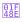

# EventFlow — Badge Visual Reference

Every badge used across the EventFlow platform, rendered as inline images.
Source styles: `public/assets/css/badges.css`, `public/assets/css/p3-features.css`, `public/assets/css/admin.css`.

> **Also see:** [Badge Gallery HTML](badges.html) · [Badge Audit & Reference](BADGE_AUDIT.md)

---

## 1 — Account Type / Role

| Badge                                                          | Name               | CSS Class                 | Category            |
| -------------------------------------------------------------- | ------------------ | ------------------------- | ------------------- |
|                    | Customer           | `.badge-customer`         | Account Type / Role |
|  | Supplier (account) | `.badge-supplier-account` | Account Type / Role |
|                      | Partner            | `.badge-partner`          | Account Type / Role |
|                          | Admin              | `.badge-admin`            | Account Type / Role |

---

## 2 — Subscription Tier

| Badge                                                 | Name              | CSS Class         | Category          |
| ----------------------------------------------------- | ----------------- | ----------------- | ----------------- |
|             | Starter           | `.badge-starter`  | Subscription Tier |
|                     | Pro               | `.badge-pro`      | Subscription Tier |
|           | Pro Plus          | `.badge-pro-plus` | Subscription Tier |
|  | Founding Supplier | `.badge-founding` | Subscription Tier |
|           | Featured          | `.badge-featured` | Subscription Tier |

> **Note:** `.badge-pro` (Pro) and `.badge-founding` (Founding Supplier) both use the `⭐` icon but are distinct badge types — Pro is a subscription tier, Founding Supplier is a founding-partner recognition award.

---

## 3 — Verification

| Badge                                                          | Name                | CSS Class                  | Category     |
| -------------------------------------------------------------- | ------------------- | -------------------------- | ------------ |
|        | Email Verified      | `.badge-email-verified`    | Verification |
|        | Phone Verified      | `.badge-phone-verified`    | Verification |
|  | Business Verified   | `.badge-business-verified` | Verification |
|           | Verified Customer   | `.badge-verified`          | Verification |
|         | Supplier (reviewer) | `.badge-supplier`          | Verification |
|                  | Unclaimed           | `.badge-unclaimed`         | Verification |

> **Unclaimed is a disclosure, not a verification:** it flags a bot-sourced listing nobody has confirmed yet (`supplier.ownershipStatus === 'unclaimed'`), not a positive trust claim. It's computed at render time in `renderVerificationBadges()`, not part of the `badges` collection — see "Dual Badge Systems" → "Unclaimed disclosure" in [BADGE_AUDIT.md](BADGE_AUDIT.md).

> **Two Supplier badges:** `.badge-supplier` (indigo, `🏢 Verified Supplier`) appears on review cards when the reviewer is a supplier account — it is a trust indicator for reviewers. `.badge-supplier-account` (green, `🏪 Supplier`) is the account/profile role badge shown on supplier profiles. They are intentionally different in colour and context.

---

## 4 — Earned / Auto-Awarded

| Badge                                                    | Name           | CSS Class               | Category              |
| -------------------------------------------------------- | -------------- | ----------------------- | --------------------- |
|  | Fast Responder | `.badge-fast-responder` | Earned / Auto-Awarded |
|            | Top Rated      | `.badge-top-rated`      | Earned / Auto-Awarded |
|                  | Expert         | `.badge-expert`         | Earned / Auto-Awarded |
|                  | Custom         | `.badge-custom`         | Earned / Auto-Awarded |

---

## 5 — Utility / Context

| Badge                                          | Name         | CSS Class          | Category          |
| ---------------------------------------------- | ------------ | ------------------ | ----------------- |
|     | New Supplier | `.new-badge`       | Utility / Context |
|  | Test Data    | `.badge-test-data` | Utility / Context |
|    | Distance     | `.badge-distance`  | Utility / Context |

---

## 6 — Lead Quality

| Badge                                                      | Name                | CSS Class                       | Category     |
| ---------------------------------------------------------- | ------------------- | ------------------------------- | ------------ |
|      | High Quality Lead   | `.lead-badge.lead-badge-high`   | Lead Quality |
|  | Medium Quality Lead | `.lead-badge.lead-badge-medium` | Lead Quality |
|        | Low Quality Lead    | `.lead-badge.lead-badge-low`    | Lead Quality |

---

## 7 — Admin Tier

| Badge                                                     | Name             | CSS Class                          | Category   |
| --------------------------------------------------------- | ---------------- | ---------------------------------- | ---------- |
|          | Free (admin)     | `.tier-badge.tier-badge--free`     | Admin Tier |
|            | Pro (admin)      | `.tier-badge.tier-badge--pro`      | Admin Tier |
|  | Pro Plus (admin) | `.tier-badge.tier-badge--pro_plus` | Admin Tier |

---

## 8 — Inline Tier Icons

| Badge                                                        | Name                 | CSS Class                       | Category          |
| ------------------------------------------------------------ | -------------------- | ------------------------------- | ----------------- |
|            | Tier Icon — Pro      | `.tier-icon.tier-icon-pro`      | Inline Tier Icons |
|  | Tier Icon — Pro Plus | `.tier-icon.tier-icon-pro-plus` | Inline Tier Icons |
